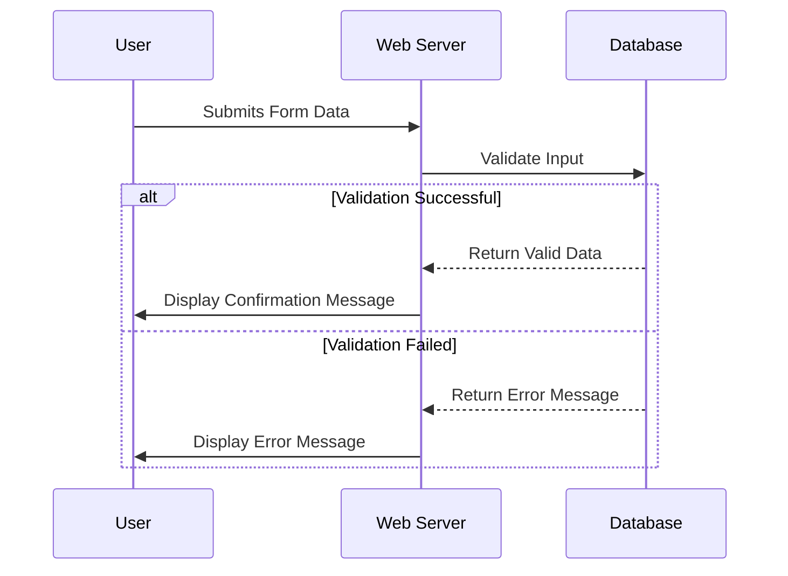

# Summary
Breaking down the benefits of using Markdown and Mermaid for documentation. They are a powerful combination, especially in modern software development and technical writing but the potential could be a lot more.

## **Markdown: The Foundation - Simplicity, Readability & Portability**

Markdown is a lightweight markup language with plain text formatting syntax. It's designed to be easy to read and write, even in its raw form. Here's why it's great for documentation:

*   **Easy to Learn & Write:** The syntax is incredibly simple.  You don't need to learn complex HTML or XML tags. Common elements like headings, lists, links, and emphasis are all handled with intuitive symbols (e.g., `#` for headings, `*` or `_` for emphasis).
*   **Readability:** Markdown files are designed to be readable in their raw text format. This is a huge advantage for authors and reviewers who want to quickly understand the content without rendering it in a specific tool.
*   **Portability & Longevity:** Markdown files are plain text (.md files). This means they're highly portable. You can open and edit them in any text editor, on any operating system.  They're also less likely to become obsolete compared to proprietary formats.
*   **Version Control Friendly:** Because Markdown is plain text, it integrates seamlessly with version control systems like Git.  You can easily track changes, collaborate effectively, and revert to previous versions.
*   **Wide Tooling Support:** A vast ecosystem of tools supports Markdown: editors, previewers, converters to HTML, PDF, etc.  You can find tools for virtually any platform and workflow.
*   **Fast to Write:** The simplicity of Markdown means you can write documentation faster, focusing on content rather than formatting.
*   **SEO Friendly:** When converted to HTML, Markdown's structure (headings, lists, links) is well-suited for search engine optimization.

## **Mermaid: Visualizing Information - Diagrams & Flowcharts**

Mermaid is a JavaScript-based diagramming and charting tool that uses text descriptions to create diagrams. It's particularly useful for technical documentation where visual representations are crucial.

*   **Text-Based Diagrams:** You define diagrams using a simple text syntax (similar to Markdown). This makes them easy to write, version control, and share.
*   **Version Control Friendly:** Because diagrams are defined in text, they're perfect for Git and other version control systems.
*   **Wide Range of Diagram Types:** Mermaid supports a variety of diagram types, including:
    *   **Flowcharts:**  Illustrate processes and workflows.
    *   **Sequence Diagrams:** Show interactions between objects or components over time.
    *   **Class Diagrams:** Represent the structure of a system using classes and relationships.
    *   **Entity Relationship Diagrams (ERD):** Model database schemas.
    *   **Gantt Charts:** Visualize project timelines and tasks.
    *   **Pie Charts & Tables:**  Present data visually.
    *   **Mind Maps:** Organize thoughts and ideas.
    *   **User Journey Diagrams:** Map out user interactions with a product or service.
*   **Integration with Markdown:** Mermaid is designed to be easily embedded within Markdown documents.  You simply enclose the diagram definition within a specific code block (usually with `mermaid` as the language).
*   **Dynamic Rendering:**  Mermaid diagrams are typically rendered dynamically using JavaScript. This means the diagram is generated on-the-fly when the Markdown document is viewed in a compatible tool.
*   **Customization:**  Mermaid offers some customization options (themes, styling) to match your documentation's overall look and feel.

## **The Combination: A Powerful Documentation Workflow**

Using Markdown *and* Mermaid together creates a very effective documentation workflow. Here's how they complement each other:

*   **Structure and Content (Markdown):** Markdown provides the overall structure, headings, lists, paragraphs, links – all the core content of your documentation.
*   **Visual Explanations (Mermaid):**  Where a visual representation is needed to clarify a concept, illustrate a process, or show relationships, you use Mermaid diagrams within your Markdown.
*   **Single Source of Truth:**  You maintain all documentation (text and diagrams) in a single set of Markdown files. This simplifies maintenance, updates, and version control.
*   **Modern Documentation Platforms:** Many modern documentation platforms (e.g., Docusaurus, MkDocs, GitBook, Read the Docs) have built-in support for both Markdown and Mermaid.  This makes it easy to create, preview, and publish your documentation online.

**Example (Markdown with Mermaid):**

```markdown
# Understanding the Order Processing System

This system handles orders from start to finish. Here's a flowchart illustrating the process:

graph TD
    A[Receive Order] --> B{Validate Order};
    B -- Valid --> C[Process Payment];
    B -- Invalid --> D[Reject Order];
    C --> E[Fulfill Order];
    E --> F[Ship Order];
```

## **Tools & Platforms that Support Markdown and Mermaid:**

*   **Docusaurus:**  A popular static site generator for documentation, especially good for React projects.
*   **MkDocs:**  Another excellent static site generator focused on simplicity and Markdown-based documentation.
*   **GitBook:** A platform for creating and publishing technical documentation, with built-in Markdown and Mermaid support.
*   **Read the Docs:** A popular platform for hosting documentation built with tools like Sphinx (which supports Markdown).
*   **Visual Studio Code:** A widely used code editor with excellent Markdown support and Mermaid extensions.
*   **Typora:**  A minimalist Markdown editor that renders diagrams in real-time.


# Markdown for System Design
Markdown can definitely be a very effective choice for system design documentation. While it might not replace dedicated modeling tools in all cases, it offers a compelling balance of simplicity, readability, and version control friendliness that makes it well-suited for many system design scenarios.

Here's a breakdown of how Markdown can be used for system design documentation, its strengths and limitations in this context, and some strategies to maximize its effectiveness:

## **How Markdown Can Be Used for System Design Documentation:**

*   **High-Level Architecture Diagrams (with Mermaid):**  As we discussed, Mermaid is fantastic for creating diagrams within Markdown. You can use it to illustrate:
    *   **Component Diagrams:** Show the major components of your system and their interactions.
    *   **Deployment Diagrams:**  Illustrate how the system is deployed across different environments (e.g., cloud, on-premise).
    *   **Context Diagrams:** Show the system's boundaries and its interactions with external systems.
*   **Detailed Design Specifications:** Markdown excels at documenting the details of individual components, modules, or services. You can use it to:
    *   **Describe APIs:**  Document endpoints, request/response formats (using tables or code blocks), and authentication methods.
    *   **Explain Data Models:**  Define entities, attributes, relationships (using tables or Mermaid ER diagrams).
    *   **Outline Algorithms:**  Describe the logic and steps involved in key algorithms.
    *   **Document Design Decisions:** Explain *why* certain design choices were made, including trade-offs considered.  This is crucial for future maintainability and understanding.
*   **Sequence Diagrams (with Mermaid):**  Illustrate the flow of interactions between different components or services in a specific scenario.
*   **State Diagrams (with Mermaid):** Model the different states of a component or system and the transitions between them.
*   **Glossary:** Create a glossary of terms used in your system design documentation.
*   **Non-Functional Requirements:** Document non-functional requirements (e.g., performance, security, scalability) and how they influence the design.
*   **Design Trade-offs:** Explicitly document any trade-offs made during the design process.

## **Strengths of Using Markdown for System Design Documentation:**

*   **Readability & Clarity:** Markdown's simple syntax promotes clear and concise writing, which is essential for design documentation.
*   **Version Control Friendly:**  Markdown files are plain text, making them ideal for Git and other version control systems. This allows you to track changes, collaborate effectively, and revert to previous versions.
*   **Portability & Longevity:** Markdown files can be opened and edited in any text editor, on any platform.
*   **Integration with Modern Documentation Platforms:** Many popular documentation platforms (Docusaurus, MkDocs, GitBook) have built-in support for Markdown and Mermaid.
*   **Fast to Write:** The simplicity of Markdown allows you to write documentation quickly, focusing on the design itself rather than complex formatting.
*   **Collaboration:** Easy to share and collaborate on with teams using tools like GitHub, GitLab, or Bitbucket.

## **Limitations & How to Mitigate Them:**

*   **Lack of Formal Modeling Capabilities:** Markdown itself doesn't provide formal modeling tools like UML or SysML.  *Mitigation:* Use Mermaid for diagrams and consider using external modeling tools (e.g., draw.io, Lucidchart) to create more complex diagrams and embed them as images in your Markdown documentation.
*   **Limited Diagramming Capabilities (without Mermaid):** Without tools like Mermaid, creating diagrams in Markdown is difficult. *Mitigation:* Embrace Mermaid and learn its syntax.
*   **No Built-in Validation:** Markdown doesn't provide built-in validation of your design. *Mitigation:* Implement code reviews and use linters to ensure consistency and accuracy.
*   **Can Become Disorganized with Large Projects:**  For very large projects, a well-defined directory structure and clear organization are crucial. *Mitigation:* Use a documentation platform that provides features like navigation, search, and cross-referencing.

## **Best Practices for Using Markdown for System Design Documentation:**

*   **Use a Consistent Style Guide:**  Establish clear guidelines for formatting, terminology, and diagramming.
*   **Keep it Concise:** Avoid unnecessary jargon and focus on conveying the essential information clearly.
*   **Use Headings Effectively:** Structure your documentation logically using headings to improve readability and navigation.
*   **Use Tables for Data:**  Tables are a great way to present data models, API specifications, and other structured information.
*   **Embrace Mermaid for Diagrams:**  Learn the basics of Mermaid and use it to create visual representations of your system design.
*   **Document Design Decisions:**  Explain the rationale behind your design choices, including any trade-offs considered.
*   **Regularly Review and Update:** Keep your documentation up-to-date as the system evolves.


# Using ChatGPT for Markdown Diagrams
You can definitely use ChatGPT (or other large language models like Bard or Claude) to generate Markdown Mermaid syntax for diagrams in your system documentation. It's a surprisingly effective technique, although it often requires some refinement and iteration to get the output exactly as you want.

Here's a breakdown of how to do it, along with tips and considerations:

## **The Prompting Strategy:**

The key is crafting clear, specific prompts that guide ChatGPT towards generating the correct Mermaid syntax. Here's a tiered approach:

*   **Tier 1: Basic Prompting (Good for Simple Diagrams):**
    *   "Generate Mermaid syntax for a flowchart that shows the process of user authentication."
    *   "Create Mermaid code to represent a sequence diagram showing how a client interacts with a server."
    *   "Write Mermaid code for a class diagram showing the relationship between 'User', 'Product', and 'Order'."
*   **Tier 2: Detailed Prompting (For More Complex Diagrams):**  Provide more context and constraints.
    *   "Generate Mermaid syntax for a sequence diagram showing the following scenario: A user logs in, then searches for a product, adds it to their cart, and proceeds to checkout. Include the following actors: User, Web Server, Database."
    *   "Create Mermaid code for a component diagram showing the following components: Web Application, API Gateway, Authentication Service, Database. Show that the Web Application uses the API Gateway and the Authentication Service."
    *   "Write Mermaid code for a state diagram showing the states of an 'Order' object: Created, Processing, Shipped, Delivered, Cancelled. Include transitions between states based on user actions."
*   **Tier 3: Iterative Refinement (Essential for Accuracy):**  This is where you'll spend most of your time.
    *   Start with a basic prompt (Tier 1 or Tier 2).
    *   Review the generated Mermaid code.
    *   Identify any errors or omissions.
    *   Provide feedback to ChatGPT: "The sequence diagram is missing the step where the server validates the user's credentials." or "Can you add a note to the class diagram indicating that 'Product' has a one-to-many relationship with 'Order'?"
    *   Repeat this process until the generated code meets your requirements.

## **Tips for Effective Prompting:**

*   **Be Specific About Actors/Components/Nodes:** Clearly identify the actors, components, or nodes involved in the diagram.
*   **Describe Interactions/Relationships:** Explain how these actors/components interact with each other or what relationships exist between them.
*   **Specify the Diagram Type:** Explicitly state the type of diagram you want (flowchart, sequence diagram, class diagram, etc.).
*   **Provide Example Data/Scenarios:** If possible, provide example data or scenarios to help ChatGPT understand the context.
*   **Use Keywords:** Include relevant keywords like "flowchart," "sequence diagram," "class diagram," "actor," "component," "relationship," etc.
*   **Break Down Complex Diagrams:** If you're trying to generate a very complex diagram, break it down into smaller, more manageable parts.
*   **Ask for Comments:**  You can ask ChatGPT to include comments in the Mermaid code to explain each step. This can be helpful for understanding and maintaining the diagram.  Example: "Generate Mermaid code for a flowchart, including comments to explain each step."

## **Example Prompt and Result (Sequence Diagram):**

*   **Prompt:** "Generate Mermaid code for a sequence diagram showing the process of a user submitting an online form. Include actors: User, Web Server, Database."

*   **ChatGPT's Response (Example):**


## **Limitations and Considerations:**

*   **Accuracy is Not Guaranteed:** ChatGPT can sometimes generate incorrect or incomplete Mermaid code. Always review and test the generated code carefully.
*   **Complexity Limits:**  Generating very complex diagrams (e.g., with many nodes and intricate relationships) can be challenging for ChatGPT.
*   **Contextual Understanding:**  ChatGPT may struggle to understand the full context of your system design, which can lead to inaccurate diagrams.
*   **Requires Manual Refinement:**  You'll almost always need to manually refine the generated code to ensure it meets your exact requirements.
*   **Hallucinations:** Like all LLMs, ChatGPT can "hallucinate" elements that don't exist in your system. Be vigilant about checking the generated code against your actual design.


## **Conclusion**

In conclusion, using Markdown and Mermaid together provides a powerful, flexible, and maintainable approach to creating technical documentation. It's a great choice for software development teams, open-source projects, and anyone who needs to create clear, concise, and visually appealing documentation. 

Markdown is a viable and often excellent choice for system design documentation, especially when combined with tools like Mermaid. It offers a good balance of simplicity, readability, version control friendliness, and integration with modern documentation platforms. While it may not replace dedicated modeling tools in all cases, it can be a powerful tool for documenting your system design effectively.

By using ChatGPT to generate Markdown Mermaid syntax is a promising technique for creating system documentation diagrams. While it requires careful prompting, review, and refinement, it can significantly speed up the diagramming process. Treat ChatGPT as a helpful assistant rather than an automated solution, and always validate its output against your actual design.
